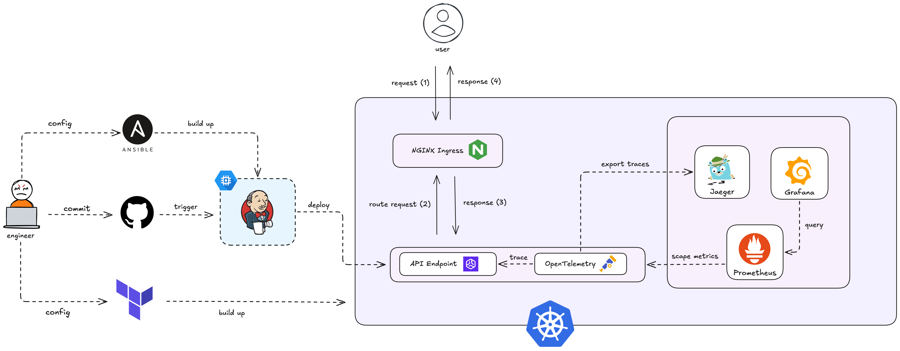

# ComfyUI Image Editing API — MLOps on GKE

An end-to-end MLOps project that deploys an AI-powered image editing API on **Google Kubernetes Engine (GKE)**.

The project includes full infrastructure-as-code (**Terraform** for GKE, **Ansible** for Jenkins), a CI/CD pipeline (**Jenkins** with GitHub webhook), monitoring (**Prometheus + Grafana**), and distributed tracing (**OpenTelemetry + Jaeger**).

---

## Table of Contents

1. [Repository Structure](#1-repository-structure)
2. [High-Level System Architecture](#2-high-level-system-architecture)
3. [Tool Installation](#3-tool-installation)
4. [RunPod Endpoint Setup](#4-runpod-endpoint-setup)
5. [Deployment Guide](#5-deployment-guide)
   - [5.1 Provision GKE with Terraform](#51-provision-gke-with-terraform)
   - [5.2 Deploy the API with Helm](#52-deploy-the-api-with-helm)
   - [5.3 Deploy Monitoring Stack](#53-deploy-monitoring-stack)
   - [5.4 Provision Jenkins VM with Ansible](#54-provision-jenkins-vm-with-ansible)
   - [5.5 Configure Jenkins CI/CD](#55-configure-jenkins-cicd)
6. [Running Locally](#6-running-locally)
7. [API Reference](#7-api-reference)
8. [Environment Variables](#8-environment-variables)

---

## 1. Repository Structure

```
.
├── api/                          # FastAPI application
│   ├── main.py                   # App entrypoint + OpenTelemetry tracing
│   ├── runpod_client.py          # RunPod serverless API client
│   ├── workflow.py               # ComfyUI workflow builder
│   ├── requirements.txt          # Python dependencies
│   ├── Dockerfile                # API container image
│   └── tests/
│       └── test_main.py          # Unit tests (pytest)
│
├── ansible/
│   ├── create_compute_instances.yml  # Provisions Jenkins GCE VM on GCP
│   ├── deploy_jenkins.yml            # Deploys Jenkins as a Docker container
│   ├── inventory.ini                 # Auto-populated VM inventory
│   └── requirements.yml              # Ansible Galaxy collections
│
├── helm/comfyui-api/             # Helm chart for GKE deployment
│   ├── values.yaml               # Config (image, replicas, ingress, OTel)
│   └── templates/                # K8s resource templates
│
├── jenkins/
│   └── Dockerfile                # Custom Jenkins image (Docker, kubectl, Helm, gcloud)
│
├── terraform/                    # GKE cluster provisioning
│   ├── main.tf
│   └── variables.tf
│
├── worker-comfyui/
│   ├── Dockerfile                # ComfyUI worker image for RunPod
│   └── image_flux2_klein_image_edit_4b_distilled.json  # ComfyUI workflow
│
└── Jenkinsfile                   # CI/CD pipeline definition
```

---

## 2. High-Level System Architecture



---

## 3. Tool Installation

### 3.1 gcloud CLI

```bash
# macOS
brew install --cask google-cloud-sdk

# Or via installer
curl https://sdk.cloud.google.com | bash
exec -l $SHELL

# Authenticate
gcloud auth login
gcloud config set project <YOUR_GCP_PROJECT_ID>
```

### 3.2 kubectl

```bash
# macOS
brew install kubectl

# Or via gcloud
gcloud components install kubectl

# Verify
kubectl version --client
```

### 3.3 Terraform

```bash
# macOS
brew tap hashicorp/tap
brew install hashicorp/tap/terraform

# Verify
terraform -version
```

### 3.4 Helm

```bash
# macOS
brew install helm

# Or via script
curl https://raw.githubusercontent.com/helm/helm/main/scripts/get-helm-3 | bash

# Verify
helm version
```

### 3.5 Docker

```bash
# macOS — install Docker Desktop
# https://docs.docker.com/desktop/install/mac-install/

# Verify
docker --version
docker login   # log in to Docker Hub
```

### 3.6 Ansible

```bash
# Requires Python 3
pip install ansible requests google-auth

# Install required Ansible collections
ansible-galaxy collection install -r ansible/requirements.yml

# Verify
ansible --version
```

---

## 4. RunPod Endpoint Setup

RunPod hosts the GPU serverless workers that run ComfyUI workflow.

### Step 1 — Create a RunPod account
Sign up at [https://runpod.io](https://runpod.io) and add credits.

### Step 2 — Build and push the ComfyUI worker image

The worker image is in `worker-comfyui/Dockerfile`. Push it to Docker Hub:

```bash
docker build --platform linux/amd64 \
  -t <your-dockerhub-user>/comfyui-worker:latest \
  -f worker-comfyui/Dockerfile worker-comfyui/

docker push <your-dockerhub-user>/comfyui-worker:latest
```

### Step 3 — Create a Serverless Endpoint on RunPod

1. Go to [RunPod Console](https://www.runpod.io/console/serverless) → **New Endpoint**
2. Fill in:
   - **Name**: `comfyui-flux`
   - **Container Image**: `<your-dockerhub-user>/comfyui-worker:latest`
   - **GPU**: Select a GPU (e.g. RTX 4090 or A100)
   - **Max Workers**: `3`
   - **Idle Timeout**: `5` seconds
3. Click **Deploy**
4. Once running, copy the **Endpoint ID** (looks like `abc123xyz`)

### Step 4 — Get your API Key

1. RunPod Console → **Settings** → **API Keys**
2. Click **Create API Key** → copy it

### Step 5 — Set environment variables

```bash
# Create .env file at project root
cat > .env << EOF
RUNPOD_API_KEY=your_runpod_api_key_here
RUNPOD_ENDPOINT_ID=your_endpoint_id_here
EOF
```

---

## 5. Deployment Guide

### 5.1 Provision GKE with Terraform

```bash
cd terraform

# Initialize
terraform init

# Review what will be created
terraform plan

# Apply (creates GKE cluster)
terraform apply
```

Connect kubectl to the new cluster:
```bash
gcloud container clusters get-credentials comfyui-cluster \
  --zone us-central1-a --project <YOUR_PROJECT_ID>
```

Install NGINX Ingress Controller:
```bash
helm repo add ingress-nginx https://kubernetes.github.io/ingress-nginx
helm repo update
helm install ingress-nginx ingress-nginx/ingress-nginx \
  --namespace nginx --create-namespace
```

### 5.2 Deploy the API with Helm

Build and push the API image:
```bash
docker build --platform linux/amd64 -t linhqyy/comfyui-api:v1 -f api/Dockerfile .
docker push linhqyy/comfyui-api:v1
```

Deploy:
```bash
export $(grep -v '^#' .env | xargs)

helm install comfyui-api ./helm/comfyui-api \
  --set image.tag=v1 \
  --set runpod.apiKey=$RUNPOD_API_KEY \
  --set runpod.endpointId=$RUNPOD_ENDPOINT_ID

kubectl rollout status deployment/comfyui-api -n image-editing
kubectl get ingress -n image-editing   # get public IP
```

### 5.3 Deploy Monitoring Stack

```bash
# Add Helm repos
helm repo add prometheus-community https://prometheus-community.github.io/helm-charts
helm repo add jaegertracing https://jaegertracing.github.io/helm-charts
helm repo update

# Prometheus + Grafana
helm install prometheus prometheus-community/kube-prometheus-stack \
  --namespace monitoring --create-namespace \
  --set grafana.service.type=LoadBalancer

# Jaeger
helm install jaeger jaegertracing/jaeger \
  --namespace monitoring

# Get Grafana external IP and password
kubectl get svc prometheus-grafana -n monitoring
kubectl --namespace monitoring get secret prometheus-grafana \
  -o jsonpath="{.data.admin-password}" | base64 -d && echo
```

### 5.4 Provision Jenkins VM with Ansible

**Create a GCP service account for Ansible:**

```bash
gcloud iam service-accounts create ansible-sa \
  --display-name="Ansible SA" --project=<YOUR_PROJECT_ID>

# Grant required roles
for ROLE in roles/compute.instanceAdmin.v1 roles/compute.securityAdmin \
            roles/iam.serviceAccountUser roles/container.developer; do
  gcloud projects add-iam-policy-binding <YOUR_PROJECT_ID> \
    --member="serviceAccount:ansible-sa@<YOUR_PROJECT_ID>.iam.gserviceaccount.com" \
    --role="$ROLE"
done

# Download key
gcloud iam service-accounts keys create ansible/sa-key.json \
  --iam-account=ansible-sa@<YOUR_PROJECT_ID>.iam.gserviceaccount.com
```

**Provision and configure the VM:**

```bash
# Step 1: Create GCE VM (auto-writes inventory.ini with the VM's IP)
ansible-playbook ansible/create_compute_instances.yml

# Step 2: SSH in once to generate gcloud SSH keys
gcloud compute ssh jenkins-vm --zone=us-central1-a

# Step 3: Install Jenkins as a Docker container
ansible-playbook -i ansible/inventory.ini ansible/deploy_jenkins.yml
```

**Get Jenkins initial admin password:**

```bash
ansible jenkins-vm -i ansible/inventory.ini -m shell \
  -a "docker exec jenkins cat /var/jenkins_home/secrets/initialAdminPassword" \
  --become
```

Open Jenkins at `http://<VM_EXTERNAL_IP>:8080` and complete setup with suggested plugins.

**Authenticate Jenkins with GKE:**

```bash
ansible jenkins-vm -i ansible/inventory.ini -m copy \
  -a "src=ansible/sa-key.json dest=/tmp/sa-key.json" --become

ansible jenkins-vm -i ansible/inventory.ini -m shell \
  -a "docker cp /tmp/sa-key.json jenkins:/tmp/sa-key.json && \
      docker exec jenkins gcloud auth activate-service-account --key-file=/tmp/sa-key.json && \
      docker exec jenkins gcloud config set project <YOUR_PROJECT_ID> && \
      docker exec jenkins gcloud container clusters get-credentials comfyui-cluster --zone us-central1-a" \
  --become
```

### 5.5 Configure Jenkins CI/CD

**Add credentials** in Jenkins → Manage Jenkins → Credentials → Global → Add:

| ID | Kind | Value |
|----|------|-------|
| `dockerhub-credentials` | Username/Password | Docker Hub login |
| `runpod-api-key` | Secret text | RunPod API key |
| `runpod-endpoint-id` | Secret text | RunPod endpoint ID |

**Create the pipeline job:**
1. New Item → name it `comfyui-api` → **Pipeline**
2. Build Triggers → ✅ **GitHub hook trigger for GITScm polling**
3. Pipeline → Definition: **Pipeline script from SCM**
4. SCM: Git → Repository URL: `https://github.com/<user>/<repo>.git`
5. Script Path: `Jenkinsfile` → Save

**Add GitHub webhook:**
- GitHub repo → Settings → Webhooks → Add webhook
- Payload URL: `http://<JENKINS_VM_IP>:8080/github-webhook/`
- Content type: `application/json` → trigger on **push events** → Save

From now on, every `git push` triggers: **Test → Build → Push → Deploy** automatically.


